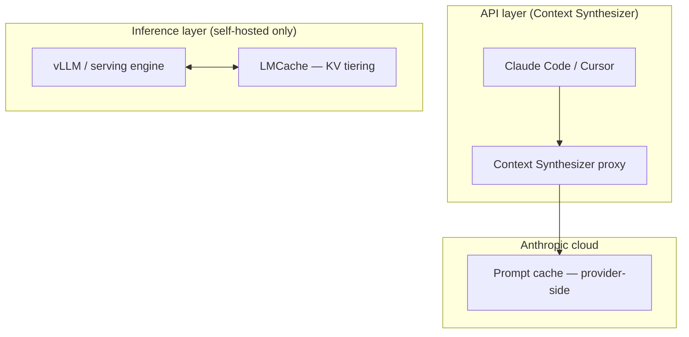

# Context Synthesizer (Context-OS)
## A Field Engineer's Guide to LLM Context Economy

---

> **What this document is:** Engineering record for the **Context Synthesizer** proxy — design rationale (LLM physics, caching economics, OS memory analogy) plus what is **shipped** in `context-synthesizer/` vs **planned** next.
>
> **Companion docs:** [`README.md`](../context-synthesizer/README.md) · [DEVELOPER_ONBOARDING.md](guides/DEVELOPER_ONBOARDING.md) · [COST_SAVINGS.md](guides/COST_SAVINGS.md) · [DASHBOARD.md](guides/DASHBOARD.md)

---

## Shipped vs. Planned

| Feature | Status | Location / notes |
|---------|--------|------------------|
| Four-layer index-aligned payload | **Shipped** | `/v1/messages`: `assemble_upstream_messages()` + `proxy_message_bridge.py`; `/v1/chat/completions`: legacy `build_optimized_messages()` |
| Ignore IDE cumulative history; use last user turn only | **Partial** | OpenAI shim only; `/v1/messages` preserves tool-faithful recent tail |
| Per-session state via `X-Session-Id` header | **Shipped** | `resolve_session_id()` — not in message body |
| `cache_control` on Layer 1 + Layer 2 | **Shipped** | `build_layer1_message()`, `build_layer2_message()` |
| Async Anthropic client | **Shipped** | `AsyncAnthropic` |
| Streaming (`stream: true` → SSE) | **Shipped** | `_handle_streaming()` |
| Bifurcated telemetry (terminal + JSONL) | **Shipped** | `telemetry.py` — `record_telemetry()` |
| Live web dashboard (`/dashboard`) | **Shipped** | `dashboard_routes.py` + `static/dashboard.html` |
| Dreaming v4 compaction | **Shipped** | `compaction.py` + `dream_compact()` in `proxy_tool.py` |
| Turn + token compaction triggers | **Shipped** | `MAX_TURNS_THRESHOLD`, `COMPACTION_TOKEN_THRESHOLD`, `MAX_LAYER3_TURNS` |
| Haiku compaction model | **Shipped** | `claude-haiku-4-5-20251001` via `COMPACTION_MODEL` |
| 12-turn JetBrains simulator | **Shipped** | `test_simulator.py` (internal gateway validation) |
| Layer 1 token budget verifier | **Shipped** | `count_tokens.py` |
| Model registry | **Shipped** | `models.py` |
| Tool-faithful message bridge | **Shipped** | `proxy_message_bridge.py` |
| Production `Claude.md` template | **Shipped** | Default install ~1,600+ tokens (above 1,024 cache floor); `Claude.minimal.md` stub ~380 tokens for experiments |
| State Override validation | **Shipped** | `ledger_validation.py` — programmatic override after `dream_compact()`; Dreaming v4 rules |
| `csynth upgrade` | **Shipped** | `scripts/upgrade.sh` — in-place update from git or GitHub archive |
| Dashboard cache-floor banner | **Shipped** | `dashboard_api.prefix_cache_status()` when L1+L2 < 1,024 tokens |
| Asymmetric tiered routing (§7) | **Planned** | Not in codebase |
| Per-layer token counts in telemetry | **Planned** | Char estimates in `ContextSnapshot` today |

---

## Table of Contents

1. [The Problem: Why Long Sessions Bleed Money](#1-the-problem)
2. [The Physics: Why You Can't Just "Skip" Old Context](#2-the-physics)
3. [The Economics: How Prompt Caching Changes Everything](#3-the-economics)
4. [The OS Analogy: Borrowing from Operating System Design](#4-the-os-analogy)
5. [Architecture: The Four-Layer Context Stack](#5-architecture)
6. [The Dreaming Loop: Asynchronous State Synthesis](#6-the-dreaming-loop)
7. [Future: Asymmetric Tiered Routing](#7-future-asymmetric-tiered-routing)
8. [Telemetry: Measuring What You Save](#8-telemetry)
9. [Implementation: Repository Layout](#9-implementation-repository-layout)
10. [Deployment](#10-deployment)
11. [Ecosystem Comparison](#11-ecosystem-comparison)
12. [Comprehension Checkpoints](#12-comprehension-checkpoints)

---

## 1. The Problem

### The Context Tax

Imagine a developer working on a large Java microservices product. They've built a 200,000-token `Claude.md` file — a detailed blueprint of their architecture, coding conventions, API contracts, and domain rules. Every time they ask the AI assistant a question, this file needs to accompany the request so the AI understands the full context of the system.

By turn 15 of a debugging session, the payload sent to the API *without optimization* looks like this:

```
Component                    | Token Count
-----------------------------|-------------
Claude.md (architecture)     | 200,000
Chat history (15 turns)      | 150,000
Current prompt               |   5,000
-----------------------------|-------------
TOTAL INPUT                  | 355,000
Expected output              |   4,000
```

**The uncomfortable truth:** To get a 4,000-token answer, you are paying for 355,000 tokens of input — every single turn. And on turn 16, you pay for 359,000. This is the **Context Tax**: the cost of re-sending the same background knowledge because the model has no persistent memory of its own.

### Why This Matters Financially

At Claude Sonnet 4.6's standard input rate of $3.00 per 1M tokens:

```
50 turns × ~355,000 avg input tokens = 17,750,000 tokens
17,750,000 ÷ 1,000,000 × $3.00 = $53.25 per session (naive)
```

> **Real-world nuance:** Claude Code on Max/Pro already achieves high `cache_read` on long sessions. The naive bill above assumes **no caching** — useful as an upper bound on *history bloat*, not as today's invoice. Our value is **shrinking the cached prefix and uncached tail**, not enabling caching.

The **target** for Context Synthesizer is ~80–90% input-cost reduction once a production-sized `Claude.md` is cached. The 12-turn proxy simulator measured **10.2%** on a starter `Claude.md` ([§8.1](#81-proxy-simulator-benchmark)).

---

## 2. The Physics

### Why Can't the Model Just "Remember" Previous Turns?

**Large Language Models are mathematically stateless.** Every API call is an isolated computation. The model cannot remember prior turns unless you re-send them.

### Autoregressive Decoding

Each output token requires attention over the full prior sequence:

```
[Claude.md (200K)] + [History (150K)] + [New Prompt (5K)]
                              │
                    Dense Attention Matrix
                              │
                    One Token Predicted (× N output tokens)
```

Dropping static rules or history makes the model blind to architecture and prior decisions.

### The KV Cache: Efficient, but Not Free

Inference engines use a **KV cache** in GPU VRAM. Cloud APIs are multi-tenant — between your requests the GPU serves other users. **Prompt caching** (Anthropic's prefix cache) lets the API reuse pre-computed prefix state when the byte-identical prefix returns within the cache TTL (~5 minutes for `ephemeral`).

---

## 3. The Economics

### Prompt Caching: The 90% Discount

Requirements for a cache breakpoint ([Anthropic docs](https://platform.claude.com/docs/en/build-with-claude/prompt-caching)):

1. Content at a defined position in the prompt with `cache_control: {"type": "ephemeral"}`
2. **Byte-identical** on subsequent requests (for that breakpoint's prefix)
3. Meets the **minimum cacheable length** for your model

**Sonnet 4.6 pricing (default chat model):**

| Token Type | Rate (/1M) | Notes |
|------------|------------|-------|
| Uncached input | $3.00 | `input_tokens` — tail after last breakpoint |
| Cache read | $0.30 | **90% off** base input |
| Cache write (5m) | $3.75 | 1.25× base; first-time store |
| Output | $15.00 | Not cacheable |

Other models use different base rates (e.g. Claude Fable 5: $10 / $1 / $12.50 per 1M). See `context-synthesizer/models.py` and set `ANTHROPIC_MODEL` consistently in proxy and `count_tokens.py`.

### Minimum cacheable length

For **Claude Sonnet 4.6** on the Claude API: **1,024 tokens** per cache block. Shorter blocks are processed without caching — no error returned. Verify via `cache_read_input_tokens` and `cache_creation_input_tokens` in `usage`.

The **default shipped** `Claude.md` is a **production template (~1,600+ tokens)** — above the 1,024-token floor on Sonnet-class models. The **`Claude.minimal.md` stub (~380 tokens)** is below the floor; use it only for experiments. Early turns may still show zero `cache_read` until the prefix is written once; judge long sessions on dashboard **cost vs payload**, not turn 1.

### The Cache-Busting Vulnerability

Prefix matching is strict from index 0:

```
❌ INVALID — CACHE BUSTED
  messages[0]: "Session: user-abc-2026-06-10T09:52:11"  ← Dynamic UUID in body
  messages[1]: Claude.md block                           ← Never matches

✅ VALID — CACHE LOCKED (our proxy)
  HTTP header: X-Session-Id: user-abc                      ← Session outside payload
  messages[0]: Claude.md + cache_control                 ← Static from index 0
  messages[1]: History ledger + cache_control            ← Breakpoint 2
  messages[2..]: sliding turns + new prompt              ← Uncached tail
```

**Never** put timestamps, UUIDs, or session counters inside cached message blocks. The proxy scopes sessions via **`X-Session-Id`** (also `session-id`, `x-jetbrains-session-id`).

### Multiple cache breakpoints

Up to **4 breakpoints** per request. Context Synthesizer uses **two**:

```json
[
  { "text": "Claude.md",           "cache_control": {"type": "ephemeral"} },
  { "text": "History Ledger",      "cache_control": {"type": "ephemeral"} },
  { "text": "Rolling raw turns" },
  { "text": "New user prompt" }
]
```

Everything **after** the last breakpoint appears in `input_tokens` only. Target production: ~200K + ~500 cached, ~3–8K uncached tail per warm turn.

### The billing formula

```text
total_input_tokens = cache_read_input_tokens + cache_creation_input_tokens + input_tokens
```

- `cache_read_input_tokens` — prefix before last breakpoint, read from cache
- `cache_creation_input_tokens` — prefix before last breakpoint, written now
- `input_tokens` — **only** content after the last breakpoint (Layer 3 + Layer 4)

---

## 4. The OS Analogy

### Lost in the Middle

Raw transcripts growing to 150K+ tokens increase cost (uncached tail) and hurt retrieval — attention is strongest at sequence start and end.

### Memory hierarchy mapping

```
Layer 3 (rolling raw turns)     ← RAM — hot working set (uncached)
Layer 1 (Claude.md)             ← Disk page cache — KV-cached prefix
Layer 2 (synthesized ledger)    ← Swap-consolidated long-term state (KV-cached)
Post-compaction archive         ← Compressed into Layer 2 by dreaming
```

**Shipped behavior:** Layer 3 accumulates **all** user/assistant pairs since last compaction (up to **10 turns**), then clears on dreaming — not a fixed 2–3 turn cap.

### Limits of the analogy

Transformers have non-local token dependencies. Eviction is **semantic consolidation** (ledger synthesis), not arbitrary page deletion.

---

## 5. Architecture

### The Four-Layer Context Stack

The proxy rebuilds outbound requests from owned state (L1/L2) plus a recent tail.

- **`POST /v1/messages` (Claude Code):** tool-faithful — preserves `tool_use` / `tool_result` in the recent tail via `assemble_upstream_messages()`.
- **`POST /v1/chat/completions` (Cursor shim):** legacy path — uses `build_optimized_messages()` from session state + latest user prompt (see [CURSOR_TEST.md](guides/CURSOR_TEST.md)).

```
┌─────────────────────────────────────────────────────────────┐
│  LAYER 1 — Static Architecture Blueprint                    │
│  Claude.md                                                  │
│  Target: project-sized (up to ~200K)  |  Shipped default: ~1,600+ tokens   │
│  cache_control: { type: "ephemeral" }                       │
│  → Target: cache_read @ $0.30/1M after warm-up              │
├─────────────────────────────────────────────────────────────┤
│  LAYER 2 — Synthesized History Ledger                       │
│  Prefix: "Current Architectural State:\n" + ledger body     │
│  Target: ~500–2,000 tokens  |  Shipped: ~50 tokens initial  │
│  cache_control: { type: "ephemeral" }                       │
│  → Updated by background dreaming; invalidates L2 cache once  │
├─────────────────────────────────────────────────────────────┤
│  LAYER 3 — Rolling Raw Chat Window                          │
│  All user/assistant pairs since last compaction             │
│  Shipped: up to 10 exchanges, then cleared                  │
│  → No cache_control → always in input_tokens                  │
├─────────────────────────────────────────────────────────────┤
│  LAYER 4 — Active User Prompt                               │
│  Latest turn from IDE (string or block array normalized)    │
│  → No cache_control → always in input_tokens                  │
└─────────────────────────────────────────────────────────────┘
```

**Invariants enforced in code:**

- No dynamic values in Layer 1 or Layer 2 bodies
- Session isolation via HTTP headers, not message content
- Layer 1 loaded once at startup from `CLAUDE_MD_PATH` (byte-stable across requests)

---

## 6. The Dreaming Loop

### Purpose

Prevent Layer 3 from growing without bound. Merge raw turns into Layer 2 asynchronously.

### Shipped trigger

```text
turn_counter >= MAX_TURNS_THRESHOLD   (default: 10, env-configurable)
```

On trigger: snapshot `rolling_recent_turns` → clear window → reset counter → `asyncio.create_task(dream_compact(...))`. The developer's next request is not blocked.

### Token trigger (shipped)

```text
turn_counter >= MAX_TURNS_THRESHOLD
  OR  est_history_tokens >= COMPACTION_TOKEN_THRESHOLD   (default: 100,000; 0 = off)
```

`MAX_LAYER3_TURNS` trims the rolling window even if compaction is delayed.

### Shipped synthesis pipeline

1. **Snapshot** — copy `rolling_recent_turns` and current ledger
2. **Async handoff** — clear Layer 3 immediately
3. **Background call** — `claude-haiku-4-5-20251001`, `dream_compact()` in `proxy_tool.py`
4. **Flush** — overwrite `session.history_ledger` under per-session lock

**Shipped compaction prompt** (summary): merge turns into ledger; preserve decisions, paths, constraints; drop boilerplate; output ledger body only.

### State Override semantics (shipped)

When a fact changes (e.g. PostgreSQL → MongoDB), the ledger should record **current truth only**:

```
❌  - Database: was PostgreSQL, now MongoDB
✅  - Database layer: MongoDB (document store) — relational schema deprecated
```

`dream_compact()` includes State Override instructions in Dreaming v4 rules. **`validate_and_normalize_ledger()`** in `ledger_validation.py` enforces latest-wins per file path and stack key before storing L2.

---

## 7. Future: Asymmetric Tiered Routing

> **Status: Planned — not implemented.**

For prompts with no project dependency (*"Java regex for email validation"*), loading 200K+ cached context is wasteful.

```
Incoming prompt → needs project context? ──NO──► Tier 1: cheap model, no Claude.md
                              │
                             YES
                              ▼
                    Tier 2: full four-layer stack
```

Heuristic: keyword / embedding router against known modules and file paths. No code in `proxy_tool.py` today — all traffic uses the full stack.

---

## 8. Telemetry

### API `usage` fields

```json
{
  "usage": {
    "input_tokens": 3040,
    "cache_creation_input_tokens": 0,
    "cache_read_input_tokens": 200500,
    "output_tokens": 800
  }
}
```

| Field | Meaning |
|-------|---------|
| `input_tokens` | Uncached tail **after last breakpoint** (Layer 3 + Layer 4) |
| `cache_read_input_tokens` | Cached prefix read at 90% discount |
| `cache_creation_input_tokens` | Cached prefix written (1.25× surcharge) |
| `output_tokens` | Generated response |

### Bifurcated cost model (shipped — `run_bifurcated_telemetry`)

```python
def compute_costs(usage):
    uncached   = usage.input_tokens
    cache_read = usage.cache_read_input_tokens or 0
    cache_write= usage.cache_creation_input_tokens or 0
    output     = usage.output_tokens

    actual = (
        uncached    * 3.00 +
        cache_read  * 0.30 +
        cache_write * 3.75 +
        output      * 15.00
    ) / 1_000_000

    baseline = (
        (uncached + cache_read + cache_write) * 3.00 +
        output * 15.00
    ) / 1_000_000

    return actual, baseline, baseline - actual
```

Printed per request in the proxy terminal; appended to `stats/*.jsonl` (local only, gitignored).

### 8.1 Proxy simulator benchmark

12-turn run via `test_simulator.py`. **Table below used `Claude.minimal.md` (~380 tokens)** — below the cache floor. Default install uses the **production template (~1,600+ tokens)**; re-run after customizing `Claude.md`.

| Metric | Measured (minimal stub) | With production template / long sessions |
|--------|-------------------------|------------------------------------------|
| Cumulative savings | **10.2%** | Varies — run simulator + dashboard on your project |
| Cache efficiency | **29.6%** | Higher once L1+L2 prefix warms |
| Layer 1 size | ~380 tokens (stub) | ~1,600+ tokens (default template) |
| Turn 7 `input_tokens` | 1,074 (L3+L4) | Depends on session |
| Turn 7 `cache_read` | 2,541 | Grows with prefix size |

**Conclusion:** Architecture behaved correctly; stub benchmark savings were modest because the prefix was small. Customize `Claude.md`, run `count_tokens.py`, then `test_simulator.py` on your machine.

Live savings on real sessions: see [COST_SAVINGS.md](guides/COST_SAVINGS.md) and the dashboard bifurcation view.

## 9. Implementation: Repository Layout

```
smart-context-synthesizer/
├── docs/                          # User guides + this file
│   └── guides/                    # Onboarding, dashboard, CLI reference
└── context-synthesizer/
    ├── proxy_tool.py              # FastAPI gateway
    ├── proxy_message_bridge.py    # Tool-faithful message assembly
    ├── compaction.py              # Dreaming v4 preprocessing rules
    ├── ledger_validation.py       # L2 post-compaction validation
    ├── dashboard_api.py           # Dashboard aggregation + cache-floor status
    ├── telemetry.py               # Cost / cache bifurcation
    ├── test_simulator.py          # 12-turn proxy benchmark
    ├── count_tokens.py            # Layer 1 token budget
    ├── models.py
    ├── Claude.md                  # Layer 1 production template (~1,600+ tokens)
    ├── Claude.minimal.md          # Optional stub (~380 tokens, below cache floor)
    ├── experimental/              # Unsupported code (e.g. Copilot backend archive)
    ├── scripts/                   # setup, csynth CLI, upgrade.sh, proxy systemd
    ├── stats/                     # Local telemetry (gitignored)
    └── README.md
```

### Key functions (`proxy_tool.py`)

| Function | Role |
|----------|------|
| `load_claude_md()` | Load Layer 1 at startup from `CLAUDE_MD_PATH` |
| `normalize_content()` | String or JetBrains block-array → plain text |
| `assemble_upstream_messages()` | Tool-faithful layers 1–4 for `POST /v1/messages` |
| `build_optimized_messages()` | Legacy layered assembly for OpenAI `/v1/chat/completions` shim |
| `validate_and_normalize_ledger()` | Post-compaction L2 validation (`ledger_validation.py`) |
| `resolve_session_id()` | `X-Session-Id` header → per-session `SessionState` |
| `resolve_developer_id()` | `X-Developer-Id` or `TELEMETRY_DEVELOPER_ID` |
| `record_telemetry()` | Terminal report + append JSONL event |
| `dream_compact()` | Background Haiku ledger synthesis |
| `maybe_trigger_compaction()` | Turn-10 **or** token threshold (`COMPACTION_TOKEN_THRESHOLD`) |
| `proxy_messages()` | `POST /v1/messages` — sync path |
| `_handle_streaming()` | SSE forward when `stream: true` |

### Request flow

```
Claude CLI / JetBrains POST /v1/messages
  → resolve developer + session ids (headers / env)
  → normalize last user message (Layer 4)
  → build [L1, L2, L3..., L4]
  → AsyncAnthropic messages.create (or .stream)
  → record_exchange (append to Layer 3)
  → record_telemetry → stats/*.jsonl
  → maybe compact
  → return JSON or SSE
```

---

## 10. Deployment

> **Install:** [DEVELOPER_ONBOARDING.md](guides/DEVELOPER_ONBOARDING.md) — `bash install.sh your.handle` from git or `bash run-setup.sh` from a release tarball. Live compaction proxy on by default (`ENABLE_PROXY=1`).

### End-user install (recommended)

```bash
git clone https://github.com/harshilshah2501/smart-context-synthesizer.git
cd smart-context-synthesizer/context-synthesizer
bash install.sh your.handle
csynth doctor && csynth dashboard
```

### Manual dev run (venv)

```bash
cd smart-context-synthesizer
python3 -m venv .venv
.venv/bin/pip install fastapi uvicorn anthropic httpx

# Claude Code Max/Pro forwards OAuth; API key is optional fallback only.
export CLAUDE_MD_PATH="context-synthesizer/Claude.md"
export ANTHROPIC_MODEL="claude-sonnet-4-6"
export COMPACTION_MODEL="claude-haiku-4-5-20251001"

# Terminal 1 — proxy
.venv/bin/python context-synthesizer/proxy_tool.py

# Terminal 2 — verify Layer 1 size
.venv/bin/python context-synthesizer/count_tokens.py

# Terminal 3 — benchmark (optional)
.venv/bin/python context-synthesizer/test_simulator.py
```

### JetBrains configuration

| Setting | Value |
|---------|--------|
| API base URL | `http://127.0.0.1:8080` |
| Endpoint | `POST /v1/messages` |
| Session header | `X-Session-Id: developer-username` |

In IDE: `Settings → Tools → AI Assistant → Providers` → set Anthropic endpoint to `http://127.0.0.1:8080`.

### Claude CLI configuration

In `~/.claude/settings.json`:

```json
{
  "env": {
    "ANTHROPIC_BASE_URL": "http://127.0.0.1:8080",
    "TELEMETRY_DEVELOPER_ID": "developer-username"
  }
}
```

Telemetry events append to local `stats/*.jsonl`. See [DASHBOARD.md](guides/DASHBOARD.md) and [COST_SAVINGS.md](guides/COST_SAVINGS.md).

### Planned: PyInstaller binary

```bash
# Not yet packaged — future distribution option
pyinstaller --onefile context-synthesizer/proxy_tool.py
```

```
┌──────────────────┐        ┌─────────────────────────┐        ┌─────────────────┐
│  JetBrains IDEA  │ ──────▶│  Context Synthesizer    │ ──────▶│  Anthropic API  │
│  (unchanged UX)  │  HTTP  │  proxy_tool.py :8080    │  TLS   │  (cache hits)   │
└──────────────────┘        └─────────────────────────┘        └─────────────────┘
```

---

## 11. Ecosystem Comparison

Context Synthesizer sits in a **two-layer** landscape: (a) **companion tools** around the IDE/terminal, and (b) **cache/reuse systems** that attack long-context cost at different stack levels. LMCache and vLLM operate at **inference** (KV tensors on GPUs you control); Context Synthesizer operates at the **API client** (prompt text sent to Anthropic’s hosted models).

### 11.1 Companion tools (IDE / terminal)

| Capability | [`claude-devtools`](https://github.com/matt1398/claude-devtools) | [`rtk-ai/rtk`](https://github.com/rtk-ai/rtk) | **Context Synthesizer** |
|---|---|---|---|
| **Primary role** | Visual observability dashboard | Shell output compressor | API-layer context memory manager |
| **Operates on** | Local `~/.claude/` logs | Bash pipe outputs | Live HTTP API payloads |
| **Token strategy** | Visualizes degradation | Truncates CLI output | Caches static blocks; synthesizes history |
| **Active or passive** | Passive viewer | Active input filter | Active middleware |
| **IDE change** | None (companion app) | Terminal wrapper | URL redirect + optional session header |
| **Metrics** | Visual UI | No | Per-turn terminal audit + live dashboard |
| **Offline proof** | Session viewer | No | `test_simulator.py` — 12-turn gateway benchmark |

**Complementary chain:** [`rtk`](https://github.com/rtk-ai/rtk) → **Context Synthesizer** → Anthropic API → [`claude-devtools`](https://github.com/matt1398/claude-devtools) for visual audit.

### 11.2 Inference-layer vs API-layer context reuse

| | [LMCache](https://github.com/LMCache/LMCache) | [vLLM APC](https://docs.vllm.ai/en/stable/features/automatic_prefix_caching/) | [Anthropic prompt cache](https://platform.claude.com/docs/en/build-with-claude/prompt-caching) | **Context Synthesizer** |
|---|---|---|---|---|
| **Stack layer** | Inference / serving | Inference / serving | Cloud API (hosted) | API client / proxy |
| **What is reused** | KV cache blocks (attention state) | KV cache blocks for shared prefixes | Provider-side prefix state for byte-identical prompts | Structured `messages[]` + `cache_control` breakpoints |
| **Reuse fidelity** | Lossless (exact tokens) | Lossless (exact tokens) | Lossless for cached prefix bytes | **Lossy synthesis** — old turns → L2 ledger; tool loop kept verbatim |
| **Typical deployment** | Daemon beside vLLM; CPU/RAM/Redis/S3 tiers | `enable_prefix_caching=True` on self-hosted vLLM | Automatic when client sends `cache_control` | Local FastAPI proxy (`proxy_tool.py`) |
| **Primary win** | Lower **TTFT**, higher **throughput** on owned GPUs | Skip redundant **prefill** on shared prefixes | Lower **API cost** (`cache_read` vs full input) | Lower **API cost** + bounded payload on long coding sessions |
| **Multi-turn agents** | Yes — engine-level session reuse | Yes — prefix reuse across rounds | Yes — if prefix stays stable | Yes — L1/L2/L3 + tool-faithful tail |
| **Claude Code cloud (Max/Pro)** | No — you do not run the inference engine | No — same | Yes — native provider feature | **Yes** — purpose-built for this path |
| **Compaction / summarization** | No — stores tensors, not text | No | No | **Yes** — Dreaming v4 (Haiku) → architecture ledger |

**How to read the rows:** LMCache and vLLM solve *“don’t recompute attention for tokens we already prefilled.”* Anthropic prompt caching solves *“don’t bill me full price for a stable prefix the provider already has.”* Context Synthesizer solves *“my transcript is too long — compress history into cache-aligned layers while keeping active tools intact.”* Those goals overlap in **agentic multi-turn** workloads but are **not interchangeable**: you cannot drop LMCache into a Claude Code → Anthropic cloud path because you never see GPU KV state.



### 11.3 Reference links

| Topic | Link |
|-------|------|
| **Context Synthesizer (this project)** | [github.com/harshilshah2501/smart-context-synthesizer](https://github.com/harshilshah2501/smart-context-synthesizer) |
| **LMCache** (KV cache management layer) | [github.com/LMCache/LMCache](https://github.com/LMCache/LMCache) · [paper (arXiv:2510.09665)](https://arxiv.org/abs/2510.09665) |
| **vLLM** (serving engine) | [github.com/vllm-project/vllm](https://github.com/vllm-project/vllm) · [Automatic Prefix Caching](https://docs.vllm.ai/en/stable/features/automatic_prefix_caching/) |
| **Anthropic prompt caching** (hosted prefix reuse) | [platform.claude.com/docs — Prompt caching](https://platform.claude.com/docs/en/build-with-claude/prompt-caching) |
| **SGLang RadixAttention** (related inference-layer prefix sharing) | [github.com/sgl-project/sglang](https://github.com/sgl-project/sglang) |
| **Companion: session observability** | [github.com/matt1398/claude-devtools](https://github.com/matt1398/claude-devtools) |
| **Companion: shell output compression** | [github.com/rtk-ai/rtk](https://github.com/rtk-ai/rtk) |

**Install (this repo):** [DEVELOPER_ONBOARDING.md](guides/DEVELOPER_ONBOARDING.md) — `install.sh` / `run-setup.sh`, live compaction proxy by default.

---

## 12. Comprehension Checkpoints

**Checkpoint 1: Cache-Busting Diagnosis**

A developer reports 0% cache efficiency. Their client prepends `internal_user_session_uuid` to `messages[0]`.

*Diagnosis:* Dynamic content at index 0 busts the entire prefix. **Fix:** keep `messages[0]` as static `Claude.md`; put session id in `X-Session-Id` header (as shipped).

---

**Checkpoint 2: Trigger Threshold Design**

Why might a pure turn-count trigger be insufficient?

*Answer:* Turn size varies — two turns with huge dumps can exceed 100K tokens before turn 10. **Shipped:** `turns ≥ MAX_TURNS_THRESHOLD (10) OR est_history_tokens ≥ COMPACTION_TOKEN_THRESHOLD (100K, env-configurable)`.

---

**Checkpoint 3: Multi-Breakpoint Caching**

```
Block 1: Claude.md (200K)    — cache_control: ephemeral
Block 2: State Ledger (500)  — cache_control: ephemeral
Block 3: Rolling turns (3K)  — no cache_control
Block 4: New prompt (40)     — no cache_control
```

*Answer:* Blocks 1–2 → `cache_read` / `cache_creation`. Blocks 3–4 → `input_tokens` only. Warm turn: ~200.5K @ $0.30/M + ~3K @ $3.00/M.

---

**Checkpoint 4: State Override Semantics**

Bad ledger: `- Database: was PostgreSQL, now MongoDB`  
Good ledger: `- Database layer: MongoDB — relational schema deprecated`

*Answer:* State Override rule — current truth only. **Shipped** in Dreaming v4 + `ledger_validation.py`.

---

*End of Report*

---

> **Repository:** https://github.com/harshilshah2501/smart-context-synthesizer  
> **Key references:** [Anthropic Prompt Caching](https://platform.claude.com/docs/en/build-with-claude/prompt-caching) · [LMCache](https://github.com/LMCache/LMCache) · [vLLM APC](https://docs.vllm.ai/en/stable/features/automatic_prefix_caching/) · [claude-devtools](https://github.com/matt1398/claude-devtools) · [rtk](https://github.com/rtk-ai/rtk)  
> **Last aligned with codebase:** 2026-07-09 (v0.1.2 public OSS)
