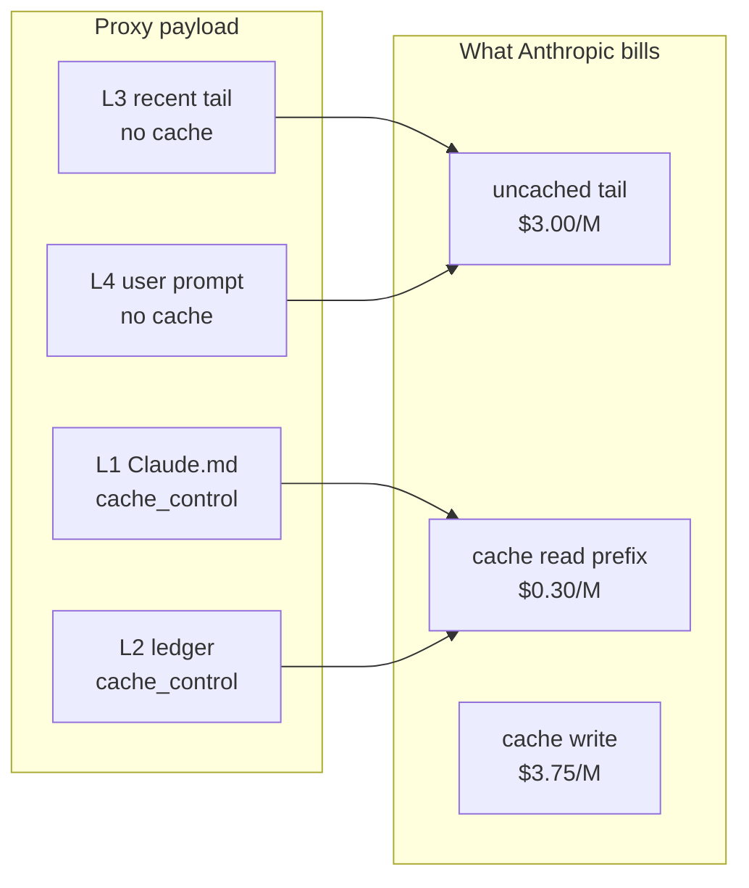

# Cost savings vs payload size

You're seeing two different metrics that measure different things. **Payload size** and **cost** are not tied the same way in this system.

## Two different “savings” numbers

| Dashboard metric | What it measures |
|------------------|------------------|
| **Shaped vs naive (payload)** | Local **character estimate** (`chars ÷ 4`) of proxy payload vs what Claude Code sent |
| **Actual vs baseline (cost)** | Anthropic’s **billing buckets** with different prices per token type |

They answer different questions:

- **Payload:** “Did we send less text?”
- **Cost:** “Did we pay less per token?”

---

## How cost goes down without a smaller payload

Billing is split into buckets. From `context-synthesizer/telemetry.py`:

```python
def compute_costs(usage: UsageSnapshot) -> CostSnapshot:
    actual = (
        (usage.input_tokens * PRICE_UNCACHED)
        + (usage.cache_read_input_tokens * PRICE_CACHE_READ)
        + (usage.cache_creation_input_tokens * PRICE_CACHE_WRITE)
        + (usage.output_tokens * PRICE_OUTPUT)
    ) / 1_000_000
    baseline = (
        (usage.total_input_tokens * PRICE_UNCACHED) + (usage.output_tokens * PRICE_OUTPUT)
    ) / 1_000_000
```

Default Sonnet 4.6 rates (override via env):

| Bucket | Rate (/1M tokens) |
|--------|-------------------|
| Uncached input (`input_tokens`) | $3.00 |
| Cache read (`cache_read_input_tokens`) | $0.30 (90% off) |
| Cache write (`cache_creation_input_tokens`) | $3.75 |
| Output | $15.00 |

- **Baseline** = pretend every input token costs **$3.00/M** (uncached).
- **Actual** = real mix: uncached $3.00, **cache read $0.30**, cache write $3.75.

So you can bill roughly the **same total input tokens** and still pay less, because a large share is priced as `cache_read_input_tokens` instead of `input_tokens`.

### Example (one warm turn from telemetry)

| Metric | Value |
|--------|-------|
| Total input | 51,200 tokens |
| Cache read | 50,000 (97.7% of input) |
| Uncached tail | 1,200 |
| Actual cost | **$0.025** |
| Baseline cost | **$0.16** |
| Saved | **~84%** |

Payload compression on that turn was also high (~75%), but the **main dollar lever** was cache-read pricing, not smaller text.

---

## Why payload size often looks flat now

After the tool-faithful proxy fix, **shaped payload is often close to naive** — by design:

1. **Faithful tool tail** — active `tool_use` / `tool_result` loops are passed through verbatim instead of being collapsed to text.
2. **Prefix on top** — L1 + L2a + L2b are **added** before the tail, so shaped can even be **larger** than naive early on (e.g. shaped ~6,054 vs naive ~5,682 tokens).
3. **Char estimate ≠ billed tokens** — dashboard uses `chars ÷ 4`; Anthropic counts tokens differently (tools, JSON, thinking blocks).

So “no significant payload improvement” is expected in short or tool-heavy sessions. Compaction (ledger summarization) mainly shows up after ~10 turns or when history gets large.

---

## What the proxy optimizes for cost



On warm turns, L1/L2 hit **cache read** at 10% of full input price. That’s the savings you see on the dashboard even when total token count is similar.

**Compaction** (Haiku “Dreaming”) is a second lever: it shrinks the ledger so the cached prefix stays smaller over long sessions — fewer tokens in every bucket, not just cheaper pricing.

---

## What to watch instead of payload size

For “why is cost lower?” look at:

1. **Cache read %** — high share ⇒ most savings from tiered pricing
2. **Uncached tail %** — should stay relatively small (recent turns + current prompt)
3. **Cumulative actual vs baseline** — dollar story
4. **Turn count** — compaction / payload shrink matter more after the threshold

**Bottom line:** Cost drops because the **stable prefix is cached at 90% off**, not because every request sends dramatically less text. With tool-faithful mode, payload size is a poor proxy for dollar savings; **cache read share** is the right one.

See also [DASHBOARD.md](DASHBOARD.md) · [context_os_technical_report.md](../context_os_technical_report.md)
